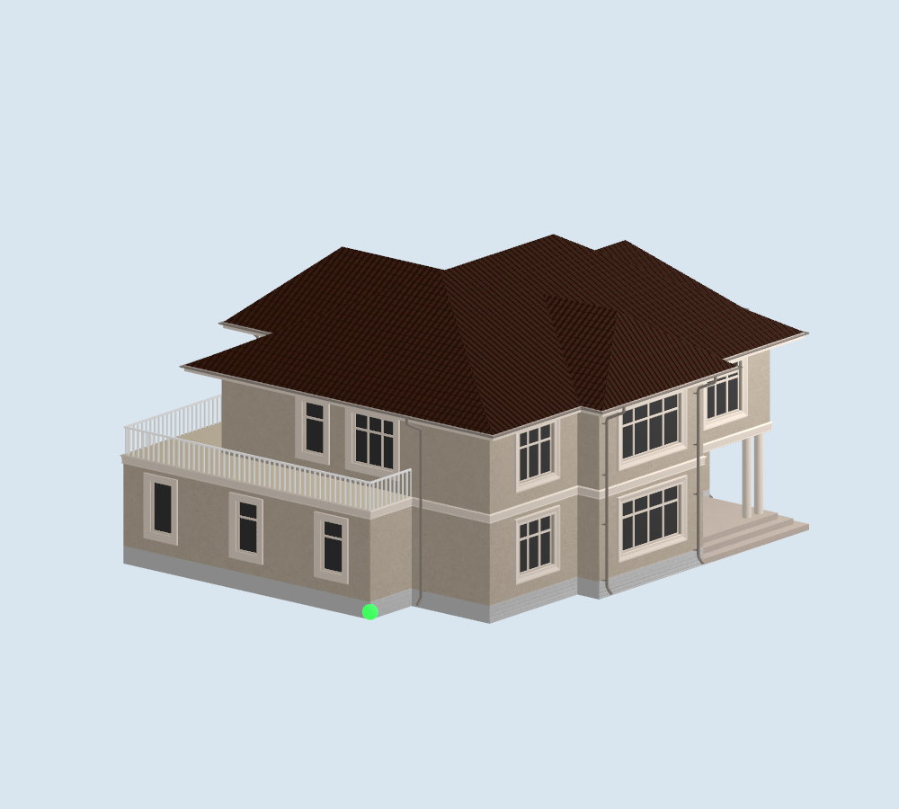
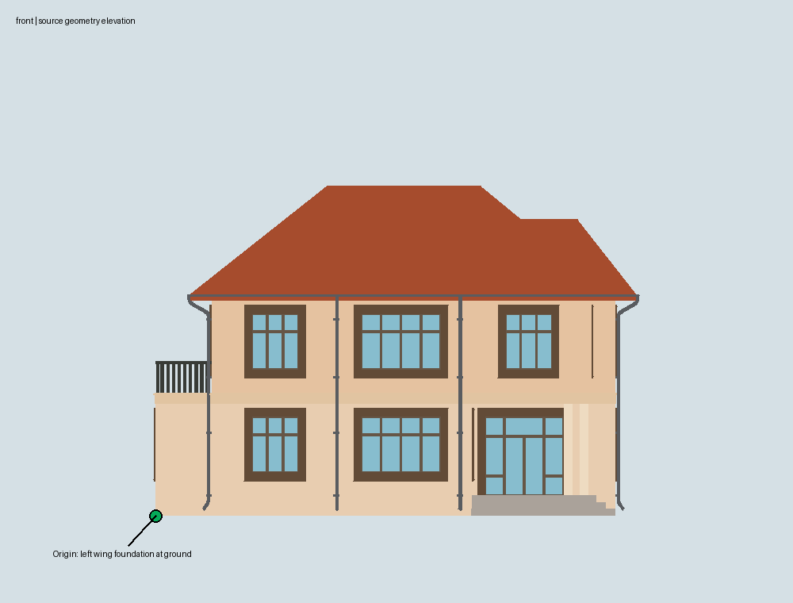

# Native model reference review

The original `house2story.glb` and the web runtime GLB are unchanged. Source SHA-256: `03f2647eed8eb6ca1d8dc1b7bc1af03b99219ebc30e42dda01f64a54bd5a84c3`.

The reviewed entrance facade faces **source -Z** and contains the ground-floor entrance and steps, with the balcony side wing at the viewer's left. Viewing a right-handed Y-up scene from -Z makes source +X appear on screen-left. The selected front-left ground reference is the **front-left foundation corner of that side wing**, which is recessed behind the central facade. It is not the entry-step corner on the viewer's right, a gutter/roof corner, or an empty corner of an overall footprint rectangle.

The first-floor wall primitive contains a ground vertex at approximately `(10.657180, 2.751341, -3.515790)` in transformed source metres. The converter asserts that this vertex exists. Native geometry is `(corner.x − source.x, source.y − corner.y, corner.z − source.z)`: a translation and a 180° Y rotation, with no resizing or reflection. Normals receive the same rotation. Native +X is facade-right, +Z faces front and -Z goes rear. This corrects the handedness ambiguity in the preserved web prototype's provisional axis convention; web code is unchanged.

RealityKit's macOS loader reports native bounds:

- Minimum: approximately `(-0.067863, 0, -9.481844)` m.
- Maximum: approximately `(15.231270, 8.300930, 4.285682)` m.
- Dimensions: `15.299133 × 8.300930 × 13.767527` m (width × height × depth).

The house extends in front of the recessed side-wing corner, and trim protrudes slightly to its left. Negative coordinates are therefore intentional. Rotation and elevation operate about the actual selected corner rather than the bounds centre.

The conversion contains 11 mesh primitives, 14,987 triangles, all 30 embedded JPEG textures, normals and UVs. USD Preview Surface maps diffuse, normal, and the source metallic/roughness channels; the original glass material remains as exported rather than introducing inferred transparency. The textured image above uses SceneKit's offscreen renderer; RealityKit separately loaded the same USDZ and checked the bounds. Rendering on the physical iPhone remains untested.

Geometry views in this folder are inspection diagrams with flat material colors, not texture or architectural accuracy evidence. Native visual review confirms the facade and selected mesh corner. The owner should confirm this side-wing corner is the intended architectural reference before field acceptance; a preferred wall/step location can be substituted by changing the recorded semantic reference and regenerating the asset. No survey or outdoor alignment accuracy has been established.
