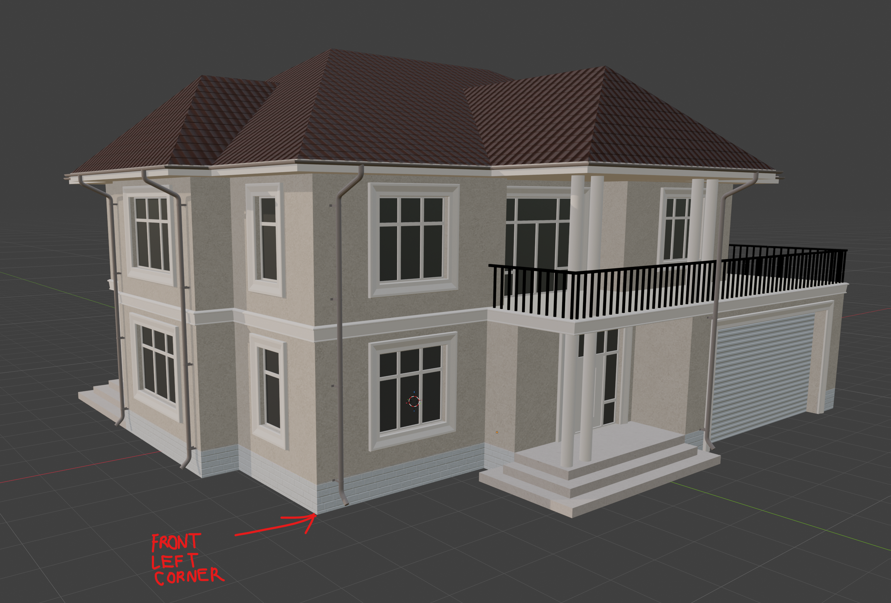
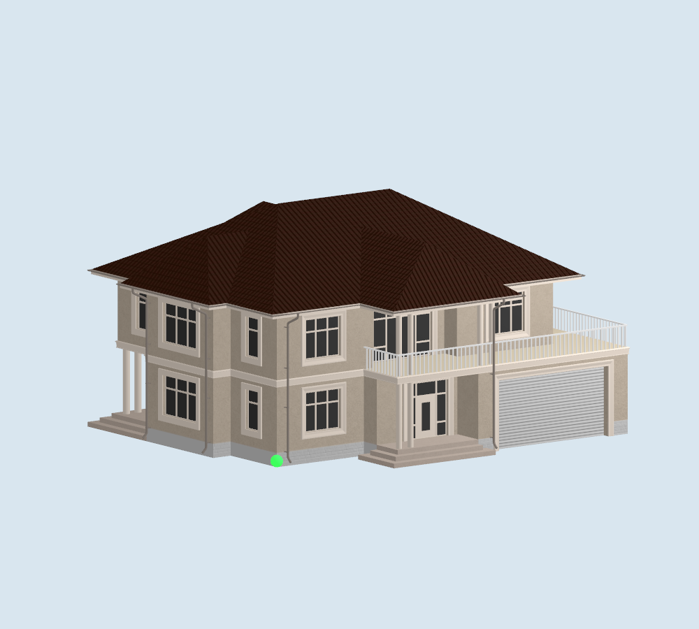

# Corrected native model reference

The active native source is `house2story-front-corrected.glb`, supplied October 9, 2026. It is retained unchanged alongside the original `house2story.glb`. The preserved web prototype still uses its original GLB and provisional normalization.

The user's marked image is authoritative for facade and corner identification. The **front** is the balcony/garage facade, with the garage on the viewer's right. The placement reference is the **front-left foundation corner of the projecting front bay beside its downspout**, left of the entry porch. It is not the porch/step edge, an overall bounding-box corner, or the earlier side-wing reference.

The first-floor wall primitive contains the selected source-world vertex at `(5.9146948158741, -0.005815446376800537, -4.7086732387542725)` metres. This export's marked corner is not at world zero, so the converter subtracts that vertex. It then maps source -Z front to native +Z front through a 180° Y-axis rotation. This explicit axis mapping replaces the previous export-specific normalization; the previous corner coordinates are not reused. Native +X is facade-right, +Y up, +Z front and -Z rear.

`ios/tools/house-reference.json` records the source filename, selected vertex, reference image, material containing that vertex and axis mapping. The converter asserts the vertex exists and dimensions remain consistent. It does not resize, mirror or stretch the house. Node rotation/scale may be omitted in this new GLB; missing transforms correctly use identity defaults.

RealityKit's macOS loader verifies approximately:

- Bounds minimum: `(-1.522586, -0.00000077, -10.982367)` m.
- Bounds maximum: `(13.776547, 8.300927, 2.785157)` m.
- Dimensions: `15.299133 × 8.300928 × 13.767524` m (width × height × depth), approximately 50.19′ × 27.23′ × 45.17′.

The sub-micrometre negative Y extent is floating-point variation between foundation vertices. Geometry extends left and forward of the selected architectural bay corner; negative coordinates are intentional. Rotation and elevation pivot around the user's selected feature, rather than around the overall bounds centre.

The corrected GLB retains 14,987 triangles, 11 material primitives and 30 embedded JPEG textures. The USDZ preserves geometry, normals, UVs and the source material mapping. The native image above is a SceneKit offscreen render of the USDZ; RealityKit independently loads that same package and checks its size. White balcony railing and opaque/dark glass follow the source textures/materials; the diagram colors are only inspection aids.

Hashes and conversion bounds are recorded in `public/models/ios/house2story-metadata.json`; structural inspection is in `house2story-front-corrected-inspection.json`. The corrected source SHA-256 is `35e9a6332eb0e50ae42aaf193bae623baca56e5b98404618d334e0f53e239938`. Both preserved original GLBs still have SHA-256 `03f2647eed8eb6ca1d8dc1b7bc1af03b99219ebc30e42dda01f64a54bd5a84c3`.

Older images directly under `docs/model-review/`, except the user's `frontleftcornerinred.png`, document the superseded normalization and must not be used as current facade/corner guidance. Current review artifacts are in `docs/model-review/corrected/`.

The owner supplied the architectural reference; the corrected textured render has been compared visually with it. Physical-iPhone confirmation of initial facade orientation, green-pin location and rotation pivot remains required. No measured alignment or outdoor accuracy is established by this conversion.
